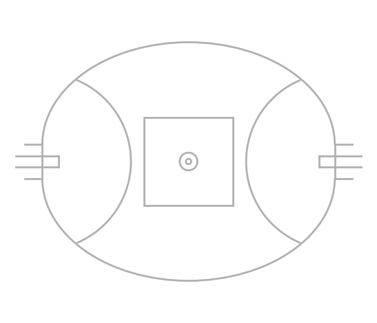
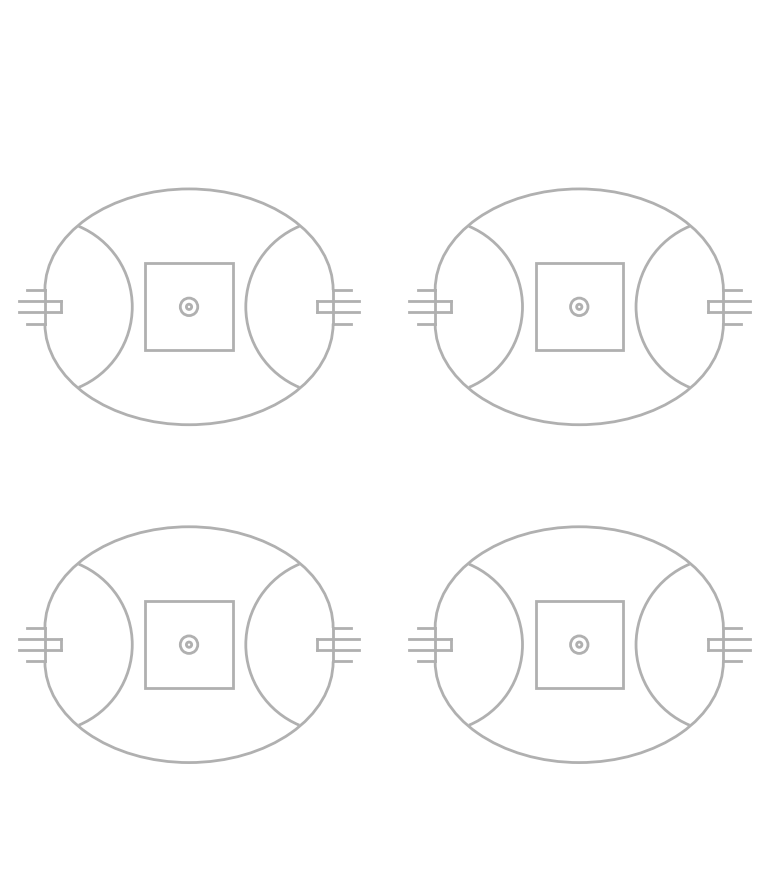
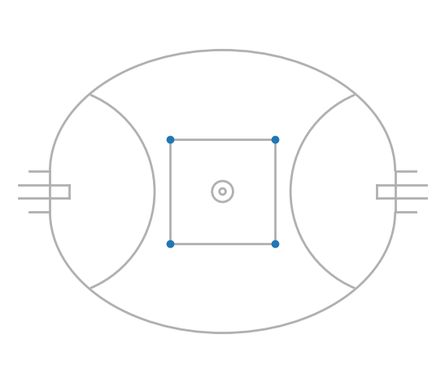
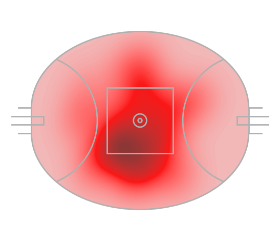
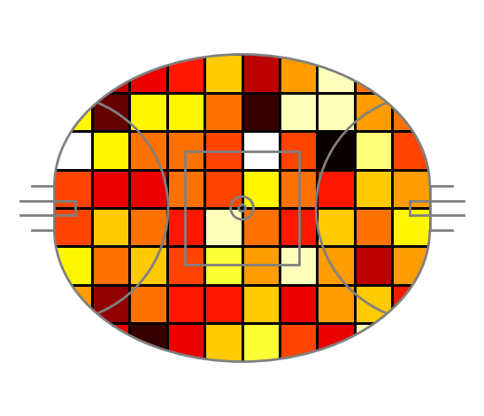
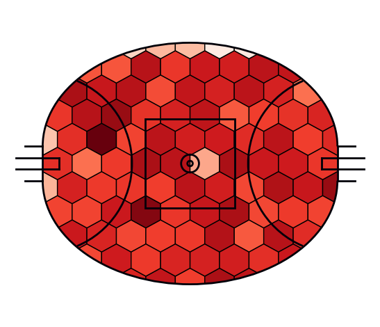
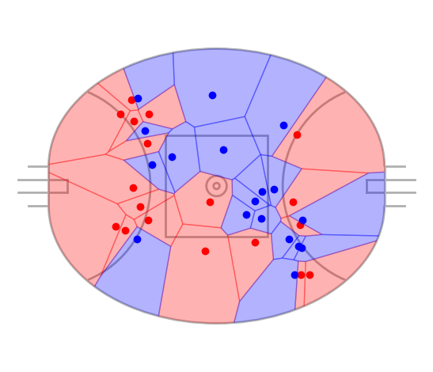
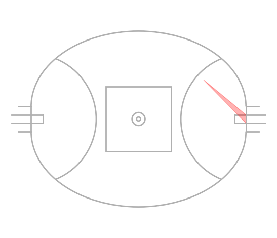

# mplfooty
mplfooty is a Python library for plotting AFL charts in Matplotlib.

Heavily **heavily** inspired and copied from [mplsoccer](https://github.com/andrewRowlinson/mplsoccer). Translated from soccer into AFL pitches for personal analysis.

## Installation

Use the package manager [pip](https://pip.pypa.io/en/stable/) to install mplfooty.

```cmd
pip install mplfooty
```

## Usage

### Pitch Plotting
```python
from mplfooty.pitch import Pitch
pitch = Pitch(pitch_width=135, pitch_length=165)
pitch.draw()
```


### Grids
```python
from mplfooty.pitch import Pitch
pitch = Pitch(pitch_width=135, pitch_length=165)
fig, axs = pitch.grid(nrows = 2, ncols = 2, axis=False)
```


### Scatter
```python
from mplfooty.pitch import Pitch
pitch = Pitch(pitch_width=135, pitch_length=165)
fig, ax = pitch.draw()
pitch.scatter(x=[25, 25, -25, -25], y=[-25, 25, -25, 25], ax=ax)
```


### Kdeplot
```python
from mplfooty.pitch import Pitch
pitch = Pitch(pitch_width=135, pitch_length=165, line_zorder=2)
fig, ax = pitch.draw()
x = np.random.uniform(low=-100/2, high=100/2, size=36)
y = np.random.uniform(low=-90/2, high=90/2, size=36)
pitch.kdeplot(x, y, ax=ax, thresh=0, fill = True, color = "red", levels=100)
```


### Heatmap
```python
from mplfooty.pitch import Pitch
pitch = Pitch(pitch_width=135, pitch_length=165, line_zorder=2, line_colour="grey", pitch_colour='black')
fig, ax = pitch.draw()
x = np.random.uniform(low=-165/2, high=165/2, size=1000)
y= np.random.uniform(low=-135/2, high=135/2, size=1000)
stats = pitch.bin_statistic(x, y, bins=(10, 8))
pitch.heatmap(stats, edgecolors="black", cmap="hot", ax=ax)
```


### Hexbin
```python
from mplfooty.pitch import Pitch
pitch = Pitch(pitch_width=135, pitch_length=165, line_zorder=2, line_colour="#000009")
fig, ax = pitch.draw()
x = np.random.uniform(low=-82.5, high=100.5, size=10000)
y= np.random.uniform(low=-82.5, high=67.5, size=10000)
pitch.hexbin(x, y, edgecolors = "black", ax=ax, cmap="Reds", gridsize=(10, 5))
```


### Voronoi
```python
from mplfooty.pitch import Pitch
pitch = Pitch(pitch_width=135, pitch_length=165)
fig, ax = pitch.draw()
x = np.random.uniform(low=-100/2, high=100/2, size=36)
y = np.random.uniform(low=-90/2, high=90/2, size=36)
teams = np.array([0] * 18 + [1] * 18)
pitch.scatter(x[teams == 0], y[teams == 0], color = "red", ax=ax)
pitch.scatter(x[teams == 1], y[teams == 1], color = "blue", ax=ax)
team1, team2 = pitch.voronoi(x, y, teams)
team1_poly = pitch.polygon(team1, ax=ax, color = "red", alpha=0.3)
team2_poly = pitch.polygon(team2, ax=ax, color = "blue", alpha=0.3)
```


### Goal Angles
```python
from mplfooty.pitch import Pitch
pitch = Pitch(pitch_width=135, pitch_length=165)
fig, ax = pitch.draw()
pitch.goal_angle(50, 30, color = "red", alpha=0.3, ax=ax)
```


## Contributing

Pull requests are welcome. For major changes, please open an issue first
to discuss what you would like to change.

Please make sure to update tests as appropriate.

## License

[MIT](https://choosealicense.com/licenses/mit/)